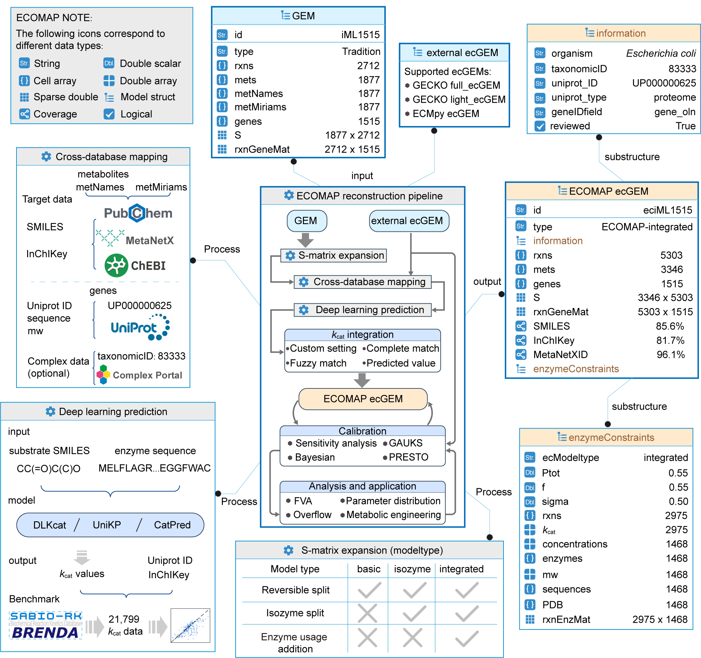

# ECOMAP

ECOMAP (Enzyme-Constrained Metabolic Modeling and Multi-Omics Analysis Platform) is a MATLAB-centered framework for the reconstruction, calibration, analysis, and design of enzyme-constrained metabolic models. The repository provides a local web interface, MATLAB Live Script tutorials, and project data for yeast, *Escherichia coli*, *Corynebacterium glutamicum*, and human metabolic models.



> The repository is currently transitioning from legacy organism directories at the repository root to project workspaces under `projects/`. This documentation describes the present working tree. Before using an existing project, verify that absolute paths in its parameter-management file refer to the local checkout.

## Scope and capabilities

| Stage | Current implementation | Primary directory |
| --- | --- | --- |
| Reconstruction | GEM import and normalization; basic, isozyme, and integrated ecModel topologies; UniProt, EC, complex, and metabolite annotation; database and deep-learning kcat integration | `scripts/Reconstruction/` |
| Calibration | Sensitivity-based tuning, multi-condition tuning, Bayesian calibration, GAUKS, PRESTO, sluice structures, and RMSE evaluation | `scripts/Calibration/` |
| Analysis | ecFVA, kcat-distribution and RMSE visualization, and Live Scripts for fermentation and overflow metabolism; the web layer additionally exposes gene-knockout and protein-usage analyses | `scripts/Analysis/` |
| Strain design | FSEOF, ecFSEOF, OptKnock, OptForce, OKO, and OKO+ | `scripts/StrainDesign/` |
| Web application | Local FastAPI service, single-page client, MATLAB Engine bridge, project and job management, and Chinese/English localization | `scripts/web/` |

Module-specific documentation is available for [reconstruction](scripts/Reconstruction/README.md), [calibration](scripts/Calibration/README.md), [analysis](scripts/Analysis/README.md), and the [MATLAB reconstruction GUI](scripts/GUI/README.md).

## Repository organization

```text
ECOMAP/
├── setup.m                         # Adds core code and available legacy projects to the MATLAB path
├── ecomapWeb.m                     # Starts and manages the local web service
├── scripts/
│   ├── Reconstruction/             # ecModel reconstruction
│   ├── Calibration/                # Parameter calibration, including Bayesian and PRESTO methods
│   ├── Analysis/                   # Analysis and visualization
│   ├── StrainDesign/               # Strain-design algorithms
│   ├── ParameterManagement/        # Project initialization and parameter management
│   ├── AnalyzeKcatMatches/         # kcat-match aggregation and evaluation
│   ├── external_kcat_prediction/   # External predictors and OKO interval construction
│   ├── utilities/                  # Model structures, I/O, and general utilities
│   ├── GUI/                        # Native MATLAB reconstruction GUI
│   └── web/                        # Web client, Python server, and MATLAB bridge
├── projects/                       # Current project-workspace convention
│   └── <project>/
│       ├── project.json
│       ├── <project>ParameterManagement.m
│       ├── models/
│       ├── reconstruction/
│       ├── calibration/
│       ├── analysis/
│       └── design/
├── tutorial/                       # Ten MATLAB Live Script tutorials
├── eciML1515/ and ecYeast/         # Retained legacy project copies
└── DLmode_evaluation/              # Deep-learning model evaluation data
```

The current `projects/` directory contains:

- `ecYeast`: *Saccharomyces cerevisiae*
- `eciML1515`: *Escherichia coli* iML1515
- `eciCW773`: *Corynebacterium glutamicum* iCW773
- `ecHuman`: human metabolic models

## System requirements

### MATLAB workflows

- MATLAB. The native GUI reports a compatibility warning for releases earlier than R2024a.
- RAVEN Toolbox and COBRA Toolbox available on the MATLAB path.
- A functional LP/MILP/QP solver. The current PRESTO configuration and OKO/OKO+ implementation explicitly require Gurobi; other workflows may also invoke a solver through RAVEN or COBRA.
- Parallel Computing Toolbox for the parallel implementation of `ecFVA` and selected calibration procedures. The web FVA bridge provides a serial fallback if the parallel implementation fails.
- Network access when retrieving UniProt, Complex Portal, or remote metabolite annotations.
- Docker Desktop only when containerized CatPred, DLKcat, or UniKP prediction is requested from the MATLAB GUI.

### Web workflow

- A local MATLAB installation with MATLAB Engine for Python support.
- Python 3.9–3.12 is accepted by `ecomapWeb.m`. The current `scripts/web/server/requirements.txt` is written for Python 3.12 and pins `matlabengine==24.2.*`; the engine package must remain compatible with the installed MATLAB release.
- Network access during initial virtual-environment creation and dependency installation.

## Quick start: web interface

Open MATLAB in the repository root and run:

```matlab
setup
ecomapWeb                 % Start the service and open the browser
```

The service listens on `http://127.0.0.1:8000` by default and is accessible only from the local machine. Service-management commands are:

```matlab
ecomapWeb('status')
ecomapWeb('log')
ecomapWeb('restart')
ecomapWeb('stop')
```

At first launch, the bootstrapper searches for Python 3.9–3.12, creates `scripts/web/server/.venv/`, and installs the backend requirements. If automatic discovery fails, create `scripts/web/server/.ecomap-python`:

```ini
python=C:\Path\To\Python312\python.exe
version=3.12.0
type=python.org
```

A bare absolute path to either the Python executable or its installation directory is also accepted. The configuration file, virtual environment, uploads, PID file, and logs are host-specific runtime artifacts and should not be committed.

The backend maintains one MATLAB Engine instance and serializes MATLAB calls. Consequently, multiple long-running jobs are not executed concurrently within a single backend process.

## Quick start: direct MATLAB use

### 1. Initialize the MATLAB path

```matlab
cd('C:\path\to\ECOMAP')
setup
```

`setup` recursively adds `scripts/`, the available legacy organism directories, and `tutorial/`. It does not recursively add `projects/*`; passing the full parameter-manager path to `ParameterManager` loads the selected project.

### 2. Load project parameters and a model

```matlab
root = fileparts(which('setup'));
manager = fullfile(root, 'projects', 'eciML1515', ...
    'eciML1515ParameterManagement.m');
params = ParameterManager.getParams(manager);

% Existing files may retain absolute paths from the originating computer.
params.projectDir        = fullfile(root, 'projects', 'eciML1515');
params.path              = params.projectDir;
params.projectJson       = fullfile(params.projectDir, 'project.json');
params.parameterManager  = manager;
params.modelsDir         = fullfile(params.projectDir, 'models');
params.reconstructionDir = fullfile(params.projectDir, 'reconstruction');
params.calibrationDir    = fullfile(params.projectDir, 'calibration');
params.analysisDir       = fullfile(params.projectDir, 'analysis');
params.designDir         = fullfile(params.projectDir, 'design');

model = loadModel(params.InitialModel, params.modeltype, ...
    params.modelsDir, params);
```

The reconstruction `loadModel` entry point currently supports `.xml`, `.json`, `.yml`, and `.yaml`. MATLAB `.mat` models are handled by the strain-design loader and selected web workflows, not by this reconstruction entry point.

### 3. Create a project

```matlab
root = fileparts(which('setup'));
InitializeECOMAPproject('myEcProject', root)
```

This command creates `projects/myEcProject/`, the five stage directories, a parameter-management file, and `project.json`, and then changes the MATLAB working directory to the new project. Before reconstruction, define the input model, model type, organism metadata, protein-pool parameters, carbon-source exchange reaction, and biomass reaction.

Several calibration functions require two fields that the current parameter template does not define automatically. Add them before calling those functions:

```matlab
params.dataDir   = fullfile(params.calibrationDir, 'data');
params.outputDir = params.analysisDir;
```

Place the experimental data in the corresponding directory. Detailed requirements are given in the [calibration documentation](scripts/Calibration/README.md).

## Model lifecycle

```text
GEM or external ecGEM
        │
        ▼
Import and normalization → ecModel topologies → annotation and kcat → merge and growth validation
        │
        ▼
Sensitivity / Bayesian / GAUKS / PRESTO calibration
        │
        ├──► ecFVA, knockout analysis, protein-usage analysis, and visualization
        │
        └──► FSEOF / OptKnock / OptForce / OKO / OKO+
```

Web-managed and standardized workflows store artifacts under `models/`, `reconstruction/`, `calibration/`, `analysis/`, and `design/`. The web project page infers step status from files in these directories; moving stage artifacts may therefore invalidate the displayed state. Some direct MATLAB entry points use relative working directories. For example, `strainDesign` writes to `workspaces/` beneath the current directory unless its execution context is managed externally.

## Tutorials

The `tutorial/` directory currently contains:

| Project | Reconstruction | Calibration | Analysis |
| --- | --- | --- | --- |
| ecYeast | `ecYeast_reconstruction_tutorial.mlx` | `ecYeast_calibration_tutorial.mlx` | `ecYeast_analysis_tutorial.mlx` |
| eciML1515 | `eciML1515_reconstruction_tutorial.mlx` | `eciML1515_calibration_tutorial.mlx` | `eciML1515_analysis_tutorial.mlx` |
| eciCW773 | `eciCW773_reconstruction_tutorial.mlx` | `eciCW773_calibration_tutorial.mlx` | `eciCW773_analysis_tutorial.mlx` |
| ecHuman | `ecHuman_tutorial.mlx` | — | — |

Run `setup`, open the required `.mlx` file in MATLAB, and execute its cells sequentially. Live Scripts are binary documents and may contain paths from the machine on which they were created; inspect and update such paths before execution.

## Principal entry points

| Module | MATLAB entry points | Web bridges |
| --- | --- | --- |
| Projects and models | `InitializeECOMAPproject`, `loadModel`, `convertecModel` | `mdpInitProject`, `mdpLoadModel`, `mdpConvertecModel` |
| Annotation and kcat | `getECnumber`, `getMetinfo`, `getComplexdata`, `getPrediction`, `completeKcatMatch`, `mergeKcats` | `mdpAnnotate`, `mdpDlPredict`, `mdpKcatCompare`, `mdpKcatMerge`, `mdpGrowthPredict` |
| Calibration | `sensitivityTuning`, `MulticonditionsensitivityTuning`, `bayesianTuning`, `GAUKS`, `PRESTO` | `mdpSensitivityTuning`, `mdpBayesian`, `mdpGauks`, `mdpPresto` |
| Analysis | `ecFVA`, `plotEcFVA`, `plotMultiECDF_Log10`, `plotRMSEBar`, `plotSciPie` | `mdpEcFva`, `mdpKnockout`, `mdpProteinAnalysis` |
| Strain design | `strainDesign` and the functions under `algorithms/` | `mdpRunFseof`, `mdpRunOptknock`, `mdpRunOptforce`, `mdpRunOko`, `mdpRunOkoPlus` |

The authoritative registry of web-executable algorithms is `scripts/web/matlab/registry/algorithmRegistry.m`.

## Troubleshooting

### `ParameterManager is not set`

Call `ParameterManager.getParams('<absolute parameter-manager path>')` before model operations and pass the returned `params` structure explicitly to downstream functions.

### Models or data cannot be found after moving the repository

Inspect `<project>ParameterManagement.m` and `project.json` for obsolete absolute paths. Direct MATLAB workflows primarily use the parameter-management file, whereas the web project manager scans `projects/<project>/project.json`.

### The web application does not start

```matlab
ecomapWeb('status')
ecomapWeb('log')
```

Inspect `.web.log`, the Python version, MATLAB Engine compatibility, the RAVEN/COBRA paths, and solver licensing. If virtual-environment reconstruction fails repeatedly within five minutes, the launcher creates `.ecomap-rebuild-failed`. Resolve the dependency failure, remove this marker, and retry.

### Solver failure or `err_gurobi_license`

Confirm that the Gurobi MATLAB interface is on the MATLAB path, the license is valid, and COBRA/RAVEN is configured to use an available solver. The current OKO and OKO+ implementation has no non-Gurobi fallback.

### External kcat prediction fails

Verify Docker availability, the required prediction image and model assets, and the separate dependencies listed in `scripts/external_kcat_prediction/requirements.txt`. These dependencies are distinct from the web-backend virtual environment.

## Development conventions

- Numerical methods should remain in MATLAB. The web layer invokes them through `mdp*.m` bridges rather than reimplementing the algorithms.
- Bridges return the common `{ok, error_code, error_message, result}` JSON envelope documented in `scripts/web/matlab/bridge/CONTRACT.md`.
- Chinese and English resources are stored in `scripts/web/matlab/i18n/zh.json` and `en.json`. The server verifies key parity at startup.
- A new web algorithm normally requires a bridge, an `algorithmRegistry.m` entry, a front-end integration, and matching entries in both localization files.

## License and citation

ECOMAP is distributed under the [MIT License](LICENSE.md). Copyright (c) 2026 ECOMAP contributors.

The repository does not currently provide a formal publication or DOI. Citation guidance should follow a subsequent release from the project maintainers.
